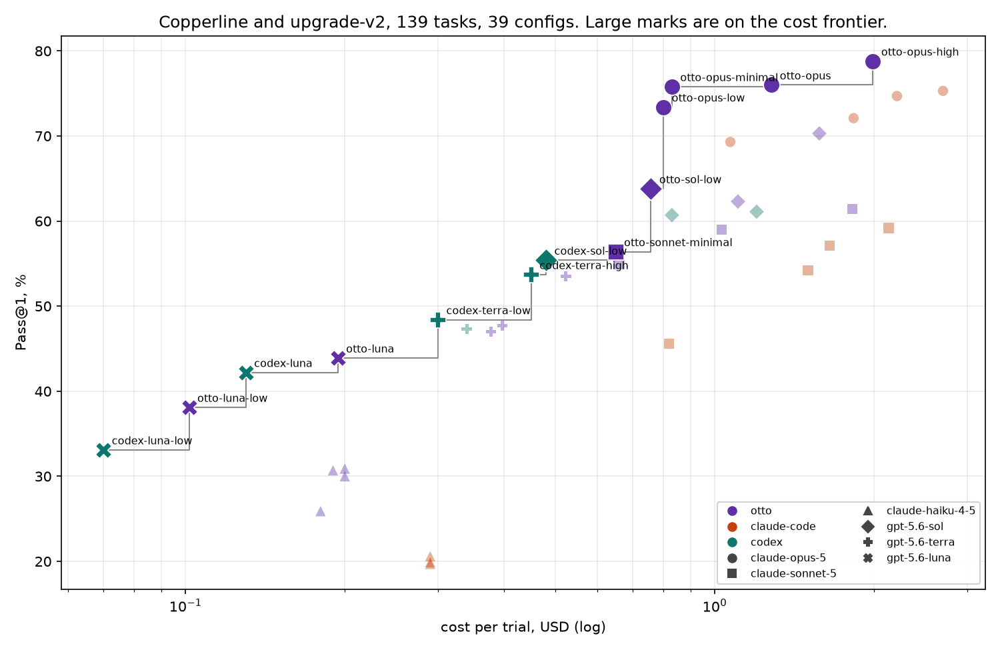

# de-bench

de-bench measures how well coding agents do real data-engineering work.
Each task is a ticket against an Airflow and dbt codebase: fix this
pipeline, trace this data-quality bug, write up what went wrong, migrate
this project to a newer Airflow. An agent gets the codebase in a container
and a time budget. When it finishes, de-bench records the changes it made
and grades them by running them. A task passes only if every one of its
checks passes.

Most data-engineering benchmarks stop at the warehouse. Spider and BIRD test
the SQL, ADE-bench and data-eng-bench test the dbt models, DataBench tests
the analysis. None of them test the thing that runs all of it in production,
and on most platforms that thing is Airflow. de-bench does.

This repo holds the codebases the agents work in, all 139 tasks with their
checks and known-good solutions, the harness that runs and scores trials on
[Modal](https://modal.com), and the results. You can read all of it without
running anything. Running it yourself needs a Modal account and your own
model credentials.



## The worlds

The codebases are called **worlds**. There are two.

**Copperline** (77 tasks) is a home, hardware and outdoor-living retailer:
268 stores in five countries, a web shop, a marketplace, about 4,000 trade
accounts on terms, and eleven years of data. Its data platform runs Airflow 3
over a DuckDB warehouse with dbt doing the transformations. It has 114 DAGs
and about 650 Airflow tasks across six team projects, and 182 data models
over 57 raw tables in two dbt projects, one mature with 625 tests and one
with 41 models and no tests at all. Beside Airflow sit two legacy schedulers
that were never fully retired. The 45-million-row warehouse is generated
from a timeline so that every number in it can be recomputed.

The world was built to the shape of real customer platforms. The median
Astronomer contract customer runs about 70 active DAGs and the median
enterprise customer about 225, so copperline is bigger than most contract
estates and smaller than most enterprise ones. Large platforms get large by
adding teams, each with its own habits, so copperline has six teams whose
conventions disagree, a governance layer the agent has to read rather than
guess, and an `AGENTS.md` like the ones customers hand their own agents.

**Upgrade-v2** (62 tasks) is a set of small Airflow projects, each pinned to
an old Airflow version, provider version or library. Each ticket asks for a
move to a newer release without changing what the DAGs do. There is no
shared tree: every task ships its own project and its own solution.

## The tasks

Copperline's tasks cover what people do in a platform like this. Grouped by
where the fix lives:

| Count | Kind |
|--:|---|
| 52 | Airflow and pipeline bugs: orchestration logic, sensors, triggers, plain Python and SQL outside dbt |
| 13 | dbt model bugs: a staging or intermediate model computing the wrong number |
| 13 | Investigation: the correct answer is a written finding with no code change |

Here is one:

> **RPT-556: the channel split is wrong for the week of 25 May.** Every run
> that day and that week finished green. Nothing failed, nothing retried,
> nothing paged, and the on-call notes close the week as "no failures".
> Work out why the 25th came out the way it did, and fix it.

The ticket gives a business-level symptom. The cause could be a DAG, bad
data or a config, and nothing in the ticket says which.

Upgrade-v2's tasks are upgrades and versioning: move a project to a newer
Airflow, bump providers, fix removed imports, keep every DAG parsing with the
same task ids on the target release.

> This project defines a custom HTTP data-service operator used by the DAG.
> Upgrade the project to Airflow 3.0. Preserve the DataServiceOperator's
> public signature and the DAG's observable behaviour.

The ticket does not list the breaking changes. The agent has to know, or
find out, what Airflow 3 removed and renamed.

Every task ships a known-good solution. `de-bench prove` checks both
directions before a task counts: the solution must pass and the untouched
project must fail. Each task's `checks.yaml` also names the plausible wrong
answers before it states the checks, so a check that could not tell a fake
from a fix would have been caught when it was written.

The worlds' faults are grounded in how real platforms fail: postmortems and
the incidents nobody caught for six months. Each world lists what is wrong
with it on purpose in its `PLANTED.md`, which the agent never sees.

## Grading

Scoring runs in stages. The DAG has to parse cleanly, then run, then the
output it produced is checked, then the run is replayed to check it is
idempotent. Expected values are recomputed from the raw tables with SQL
rather than typed in. A task counts as solved only when every check that ran
passed. Two gates apply to every task: the agent must have changed
something, and it must not have touched protected paths.

```yaml
checks:
  - kind: dag_parses        # the DagBag imports clean and the DAG exists
    dag_id: nightly_close
  - kind: dag_runs          # `airflow dags test` exits green
    dag_id: nightly_close
  - kind: warehouse_table   # the run produced the table the ticket asked for
    table: order_economics
  - kind: idempotent        # run the same date again; the warehouse must not change
    dag_id: nightly_close
```

Investigation tasks end in a written answer, and those are graded by a
judge. The task ships a fact key, the things a correct answer has to say,
and a model grades the answer against it, stating its finding before its
verdict. Every grading run scores several rounds, a conviction needs a
second model to agree, and splits go to a third. We hand-adjudicated every
judged answer and tuned the fact keys until the failures were fair and the
passes were earned. [docs/judge.md](docs/judge.md) walks through it with
real examples.

Upgrade-v2 tasks are graded by static-analysis primitives under
`src/de_bench/upgrade_v2_scoring/`: which imports moved, which pins changed,
whether every DAG still parses with the same task ids.

Agents are stochastic, so every task runs several trials and every judged
answer is graded several times. [docs/metrics.md](docs/metrics.md) defines
Pass@1, Pass@k and Pass^k.

## Results

[`RESULTS.md`](RESULTS.md) holds the September 2026 sweep: 39 configs across
three harnesses (otto, Claude Code, Codex) and six models from the Anthropic
and OpenAI families, against all 139 tasks, three to five trials per task.
The headline number is Pass@1, the mean share of trials that passed.

What it shows, in short:

- The frontier models handle most of this work. The best config passes
  79% of tasks on the two worlds together.
- The harness sets what a model costs, and part of what it scores. At the
  same model and thinking level, otto scores above Claude Code on every
  shared tier and above Codex on six of eight.
- Thinking buys accuracy, and cost rises faster than the score.
- On upgrade work the gap between harnesses is widest. Knowing what changed
  between Airflow releases matters more than reasoning harder.

otto is Astronomer's data-engineering agent. Its adapter is not part of this
repo, so the `otto-*` rows cannot be reproduced from here. The Claude Code
and Codex rows can.

## Layout

```
worlds/<name>/
  world.yaml            metadata, the system prompt, task defaults
  workspace/            the codebase the agent gets (copperline only)
  PLANTED.md            the planted faults; never shipped to the agent
tasks/<world>/<task-id>/
  task.yaml             id, status, difficulty, tags, time budget
  prompt.md             the ticket
  checks.yaml           what the scorer runs
  solution/             the known-good fix
  workspace/            the task's own project (upgrade-v2 only)
src/de_bench/           the harness: CLI, Modal images, scoring, judge, report
tools/                  the copperline generator, oracles and maintenance scripts
docs/                   how to write a task, how the judge works, what we report,
                        and the copperline design spec
results/                the data behind RESULTS.md
configs/                named sets of (agent, model, thinking) to run
```

## Running it

You need a Modal account (`modal setup`) and a Modal secret named
`de-bench-llm` that carries `ANTHROPIC_API_KEY`. If your traffic goes
through a gateway, set `ANTHROPIC_BASE_URL` in the same secret. The GPT
configs expect a gateway that serves OpenAI models under that same base URL
and token. The model names `gpt-5.6-luna`, `gpt-5.6-terra` and
`gpt-5.6-sol` are what our gateway called the three GPT-5.6 tiers.

```bash
uv sync
uv run de-bench list
uv run de-bench run --agents claude-code --limit 2 --name smoke
uv run de-bench score ~/.de-bench/runs/2026-09-16-smoke   # the directory `run` printed
uv run de-bench report ~/.de-bench/runs/2026-09-16-smoke
```

`run` starts one Modal job per (config, task, trial). Pick configs with the
agent, model and thinking flags, or run many at once with
`--matrix configs/matrix.yaml`. `--trials N` repeats each cell N times.
`--tasks`, `--world` and `--limit` narrow the task list. The defaults are
cheap: claude-haiku-4-5 at low thinking.

`score` replays each stored patch against a fresh copy of the workspace
and runs the checks. It needs no model credentials, so you can rescore any
stored run at any time. `report` turns a scored run into `report.md` and
two charts: cost per task against pass rate, and wall-clock time against
pass rate. Each chart marks the Pareto frontier, the configs that nothing
else beats on both axes.

Runs are stored under `~/.de-bench/runs`, outside the checkout. Trials are
cached in a Modal volume, keyed by agent, model, thinking, the shipped
workspace, both prompts, the time budget and the trial index. Rerunning a
cell that has already been sampled returns the stored result. Pass
`--no-cache` to sample fresh.

The committed `RESULTS.md` and `RESULTS.png` are rendered from
`results/sweep-2026-09.json` by `tools/render_results.py`.

### What a run produces

Under `~/.de-bench/runs/<date>-<name>/<config>/<task>/t<trial>/`:

- `summary.json`: status, wall time, tokens, cost
- `changes.patch`: the source diff the agent left behind
- `session.jsonl` and `transcript.jsonl`: the agent's own session file and its raw output
- `trajectory.jsonl` and `usage.jsonl`: the session in the cross-agent trajectory-v1 format, with per-step tokens and cost
- `score.json`, once `de-bench score` has run

Trials that died on infrastructure rather than on the task are marked
`infra_failed` and left out of every total.

## Harnesses

The sweep ran three: **otto**, **claude-code** and **codex**. Adapters for
claude-code, codex, opencode and pi are under `src/de_bench/agents/`. codex
speaks only the OpenAI API, so a Claude tier maps to the nearest GPT tier:
haiku to luna, sonnet to terra, opus to sol.

The trial cache keys on the agent name, not the config name. If you change
a harness and rerun the same agent, model, thinking, task and trial, you get
the old cached result back. Rename the agent or pass `--no-cache` while
iterating.

## Writing a task

[docs/authoring.md](docs/authoring.md) covers the check kinds, the
`expect_sql` pattern, the judge fact keys, and what a change to a world or a
task costs in retired trials. Editing a task retires that task's stored
trials; editing a world's `workspace/` retires every trial in that world.

## License

Apache-2.0. See [LICENSE](LICENSE).
